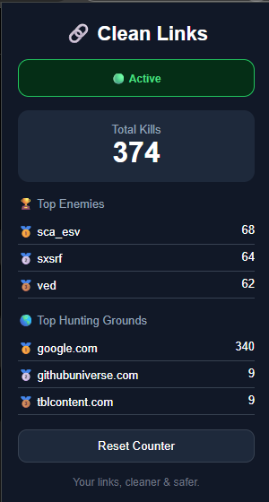

# 🔗 Clean Links

A privacy-focused Chrome extension that removes tracking parameters from URLs before they can follow you around the web.

No more URL mambo jumbo.

---

## 📸 Dashboard

<p align="center">
  
</p>

---

## ✨ Features

### 🛡️ Multi-Layer URL Protection

Clean Links protects your browsing through multiple layers:

- Capture-phase click interception
- Pre-click link cleaning
- Dynamic link monitoring
- SPA navigation interception
- Current URL cleanup

---

## 🧬 Smart Rule Engine

Clean Links removes known tracking parameters while preserving parameters that are required for functionality.

### Example

**Before**

```
https://www.google.com/search?q=weather&source=hp&oq=wea&gs_psrp=abc123
```

**After**

```
https://www.google.com/search?q=weather
```

---

## 🌎 Universal Tracker Removal

Works across websites:

- `utm_*`
- `fbclid`
- `gclid`
- `msclkid`

---

## 🔍 Google Search Cleanup

Removes Google-specific tracking and telemetry parameters:

- `source`
- `sourceid`
- `sxsrf`
- `sca_esv`
- `ei`
- `iflsig`
- `ved`
- `gs_lp`
- `gs_psrp`
- `gs_lcrp`
- `sclient`
- `oq`
- `fbs`
- `sa`

Preserves important parameters such as:

- `q` (search query)
- `hl` (language)
- `udm` (search mode)
- `ie` (encoding)
- `newwindow` (user preference)

---

## 🤖 Google AI Mode Intelligence

Clean Links includes tested support for Google AI Mode URLs.

### Removed

- `mtid`
- `ntc`
- `aep`
- `mstk`
- `csuir`

### Preserved

- `q`
- `udm`
- `newwindow`

All AI Mode parameters were manually tested to ensure AI Mode continues functioning correctly after cleanup.

---

## 📺 YouTube Cleanup

Removes:

- `si`

### Example

**Before**

```
https://youtube.com/watch?v=abc123&si=tracking-data
```

**After**

```
https://youtube.com/watch?v=abc123
```

---

## 📊 Statistics Dashboard

Clean Links tracks:

- Total trackers removed
- Most common trackers
- Most common tracking domains
- Toolbar badge counter

---

## 🏗️ Built With

- Manifest V3
- Chrome Extensions API
- MutationObserver
- Chrome Storage API
- Service Workers
- Content Scripts
- History API Interception

---

## 🚀 Installation

### Clone the repository

```bash
git clone https://github.com/tatsumioga1/clean-links.git
```

### Load into Chrome

1. Open:

```
chrome://extensions/
```

2. Enable **Developer Mode**

3. Click **Load unpacked**

4. Select the Clean Links folder

5. Enjoy cleaner URLs 🔗

---

## 🧪 Philosophy

Clean Links follows a simple rule:

> Keep what describes the user's intent.
>
> Remove what describes the website's observation.

A good URL cleaner should behave like a scalpel, not a chainsaw.

---

## 📜 License

MIT License

---

## 🐉 Project History

### v1.0

- Basic URL cleanup

### v1.3

- Statistics dashboard
- Toolbar badge counter

### v1.5

- Pre-click protection

### v2.0 — Dragon Slayer Edition

- Click interception
- SPA protection
- Dynamic link monitoring

### v2.0.3 — AI Mode Intelligence

Added support for Google AI Mode URL cleanup:

- `mtid`
- `ntc`
- `aep`
- `mstk`
- `csuir`

---

Made with ☕, curiosity, and a healthy dislike of unnecessary URL tracking.
